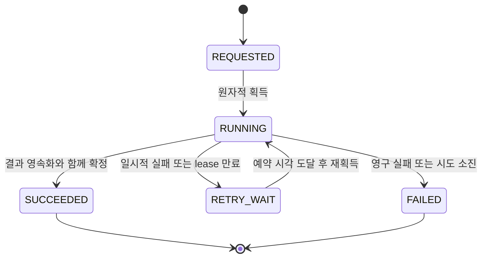

# State Transition Safety

## 1. 상태마다 의미를 고정한다



`SUCCEEDED`와 `FAILED`는 최종 상태다. 최종 실패 작업을 운영자가 다시 실행하려면 새 job을 만들고 `parent_job_id`로 연결한다. 같은 작업의 일반 재시도는 job_id를 유지한다.

## 2. 확인 후 변경하지 말고 조건과 변경을 합친다

다음은 PostgreSQL과 named parameter를 가정한 설명용 SQL이다. `attempt`는 0에서 시작하며, 획득할 때마다 증가하는 fencing token이다.

```sql
UPDATE jobs
SET status = 'RUNNING',
    attempt = attempt + 1,
    lease_until = CURRENT_TIMESTAMP + INTERVAL '60 seconds'
WHERE job_id = :job_id
  AND (status = 'REQUESTED'
       OR (status = 'RETRY_WAIT' AND next_retry_at <= CURRENT_TIMESTAMP))
RETURNING attempt, lease_until;
```

60초는 예시다. 작업 시간과 heartbeat 지연을 측정해 정한다. heartbeat는 `status = 'RUNNING' AND attempt = :owned_attempt` 조건과 유효한 lease를 확인하며 연장한다. 갱신 실패 시 소유권을 잃은 것으로 처리한다.

## 3. 종료된 줄 알았던 Worker가 돌아오는 경우

A의 lease가 만료되어 B가 attempt 2를 획득한 뒤 A가 attempt 1의 결과를 반환할 수 있다. 만료 복구는 만료된 `RUNNING`을 조건부로 `RETRY_WAIT`로 바꾸고 재처리를 예약한다. B의 재획득으로 token이 증가한다.

결과 확정 트랜잭션은 jobs 행을 잠그고 **RUNNING, 현재 attempt, lease 유효성**을 검증한 다음 결과 행과 `SUCCEEDED`를 함께 커밋한다. 검증 실패 시 전체를 롤백한다. 긴 GPU 추론 동안 DB 잠금을 잡아두지 않는다. 외부 객체 저장소 자체는 DB token을 검사하지 않으므로 attempt별 경로로 덮어쓰기를 방지한다.

## 4. 잠금 선택

| 방식 | 적합한 상황 | 비용 |
|---|---|---|
| 조건부 UPDATE / 버전 비교 | 짧은 단일 행 경쟁 | 충돌 시 재조회 필요 |
| SELECT FOR UPDATE | 여러 변경을 묶는 짧은 트랜잭션 | 대기·교착 가능 |
| Serializable | 여러 행에 걸친 불변식 | 직렬화 실패 시 트랜잭션 재시도 |

격리 수준만 지정하고 재시도 코드를 생략하면 충돌이 애플리케이션 오류로 남는다. [PostgreSQL 트랜잭션 격리](https://www.postgresql.org/docs/current/transaction-iso.html)

## 5. 반드시 확인할 불변식

- 성공 작업에는 조회 가능한 결과 포인터가 있다.
- 오래된 attempt는 상태와 최종 결과를 바꾸지 못한다.
- 만료 작업은 DB 스캐너 등 메시지 재전달과 독립적인 복구 경로가 있다.
- 재시도 예약과 이벤트 발행은 [outbox](../02_messaging_eda/applied-to-ocr.md)로 연결한다.

실습: A를 일시 정지하고 lease 만료 후 B를 완료시킨 다음 A를 재개한다. A의 결과 확정이 거부되어야 한다.
