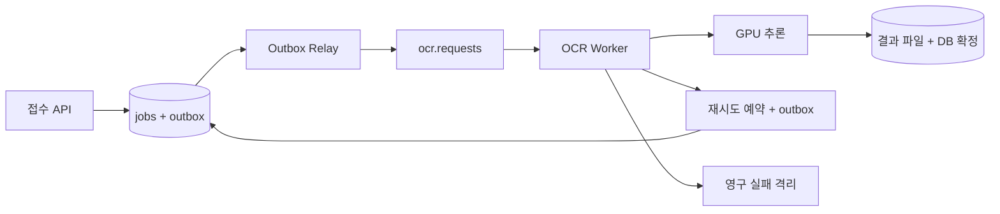

# 메시징/EDA — OCR 적용 사례

## 1. 학습용 전체 구조



도식의 DLQ 경로도 원본 offset보다 먼저 영속화하거나 Kafka transaction으로 원자화한다. DB에 최종 실패를 기록해야 한다면 실패 상태와 DLQ 발행용 outbox를 함께 저장한다.

## 2. 이벤트 계약 예시

```json
{
  "event_id": "evt-001",
  "event_type": "JobRequested",
  "schema_version": 1,
  "job_id": "job-001",
  "tenant_id": "tenant-a",
  "input_uri": "s3://example/input/immutable-image.png",
  "model_version": "ocr-v1",
  "trace_id": "trace-001"
}
```

URI는 예시다. 대용량 이미지 대신 불변 참조를 전달한다. 워커가 처리 전에 DB에서 현재 상태·입력·모델 버전을 검증하게 하고, 메시지의 오래된 상태를 그대로 덮어쓰지 않는다. 추적 ID를 로그에 연결하되 job_id를 메트릭 label로 사용해 시계열 수를 폭증시키지 않는다.

## 3. 왜 Outbox인가?

DB commit과 Kafka 발행을 별도로 수행하면 한쪽만 성공할 수 있다. jobs와 전송할 이벤트를 같은 DB 트랜잭션에 기록하고 Relay가 미발행 이벤트를 전달한다. Relay가 전송 후 표시 전에 죽으면 중복 발행되므로 Consumer 멱등성이 필요하다. [AWS Transactional Outbox](https://docs.aws.amazon.com/prescriptive-guidance/latest/cloud-design-patterns/transactional-outbox.html)

이 설계에서는 발행 확인 뒤 `published_at`을 표시하고, 가장 오래된 미발행 행의 나이를 모니터링한다. DB 재시도 예약에도 동일한 경로를 사용한다.

## 4. 운영상 경계

메시지 보존 기간보다 긴 장애가 발생하면 Kafka 재전달만으로는 복구할 수 없다. DB의 미완료 작업 스캔과 입력 보존 정책을 함께 둔다. job_id key는 작업 관련 메시지의 지역성을 돕지만, 재시도 토픽까지 포함한 상태 순서를 보장하는 수단은 상태 머신이다.

실습 산출물: API 접수, outbox 발행, Worker 획득, 결과 확정, offset commit이 한 trace로 연결된 로그와 각 경계의 장애 주입 결과.
